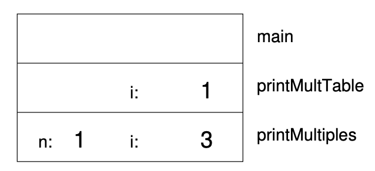

Local variables
---------------

About this time, you might be wondering how we can use the same variable
``i`` in both ``printMultiples`` and ``printMultTable``. Didn’t I say
that you can only declare a variable once? And doesn’t it cause problems
when one of the functions changes the value of the variable?

The answer to both questions is “no,” because the ``i`` in
``printMultiples`` and the ``i`` in ``printMultTable`` are *not the same
variable*. They have the same name, but they do not refer to the same
storage location, and changing the value of one of them has no effect on
the other.

Remember that variables that are declared inside a function definition
are local. You cannot access a local variable from outside its “home”
function, and you are free to have multiple variables with the same
name, as long as they are not in the same function.

The stack diagram for this program shows clearly that the two variables
named ``i`` are not in the same storage location. They can have
different values, and changing one does not affect the other.

Notice that the value of the parameter ``n`` in ``printMultiples`` has
to be the same as the value of ``i`` in ``printMultTable``. On the other
hand, the value of ``i`` in ``printMultiple`` goes from 1 up to ``n``.
In the diagram, it happens to be 3. The next time through the loop it
will be 4.

It is often a good idea to use different variable names in different
functions, to avoid confusion, but there are good reasons to reuse
names. For example, it is common to use the names ``i``, ``j`` and ``k``
as loop variables. If you avoid using them in one function just because
you used them somewhere else, you will probably make the program harder
to read.
