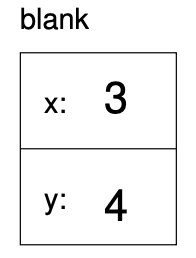

``Point`` objects
-----------------

As a simple example of a compound structure, consider the concept of a
mathematical point. At one level, a point is two numbers (coordinates)
that we treat collectively as a single object. In mathematical notation,
points are often written in parentheses, with a comma separating the
coordinates. For example, :math:`(0, 0)` indicates the origin, and
:math:`(x, y)` indicates the point :math:`x` units to the right and
:math:`y` units up from the origin.

A natural way to represent a point in C++ is with two ``double``\ s. The
question, then, is how to group these two values into a compound object,
or structure. The answer is a ``struct`` definition:

::

   struct Point {
     double x, y;
   };

``struct`` definitions appear outside of any function definition,
usually at the beginning of the program (after the ``include``
statements).

This definition indicates that there are two elements in this structure,
named ``x`` and ``y``. These elements are called **instance variables**,
for reasons I will explain a little later.

It is a common error to leave off the semi-colon at the end of a
structure definition. It might seem odd to put a semi-colon after a
squiggly-brace, but you’ll get used to it.

Once you have defined the new structure, you can create variables with
that type:

::

     Point blank;
     blank.x = 3.0;
     blank.y = 4.0;

The first line is a conventional variable declaration: ``blank`` has
type ``Point``. The next two lines initialize the instance variables of
the structure. The “dot notation” used here is similar to the syntax for
invoking a function on an object, as in ``fruit.length()``. Of course,
one difference is that function names are always followed by an argument
list, even if it is empty.

The result of these assignments is shown in the following state diagram:

As usual, the name of the variable ``blank`` appears outside the box and
its value appears inside the box. In this case, that value is a compound
object with two named instance variables.

.. mchoice:: question_eight_one
   :practice: T
   :answer_a: blank.x = 3.0;
   :answer_b: Point.x = 3.0;
   :answer_c: nice.x = 3.0;
   :answer_d: nice.x = 3.0
   :correct: c
   :feedback_a: This declaration would not work for the specific code block below.
   :feedback_b: The specific name of the structure should be used, not its type.
   :feedback_c: Correct!
   :feedback_d: The semi-colon is missing at the end.

   Which of the following would be the correct way to create a variable with a point type, given the code below.

   .. code-block:: cpp

      struct Point () {
        double x, y;
      };

      int main() {
        Point nice;
      }

.. parsonsprob:: question_8_1

   Construct a block of code that correctly creates variables of a certain structure's type.
   -----
   struct Point {

      double x, y;

   };

   int main() {

      Point blue;

      blue.x = 3.0;

      Point.x = 3.0; #distractor
   }

.. mchoice:: question_eight_point_two
   :practice: T
   :answer_a: outside of any function definition, usually at the beginning of the program
   :answer_b: after the main function
   :answer_c: after the include statements
   :answer_d: both a and c
   :correct: d
   :feedback_a: Try again!
   :feedback_b: Try again!
   :feedback_c: Try again!
   :feedback_d: Correct!

   ``struct`` definitions occur...
